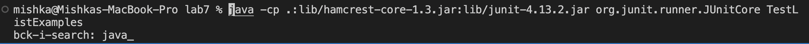
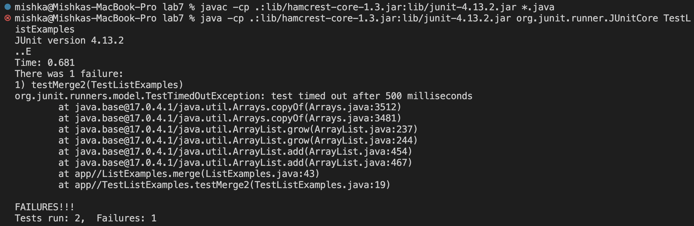
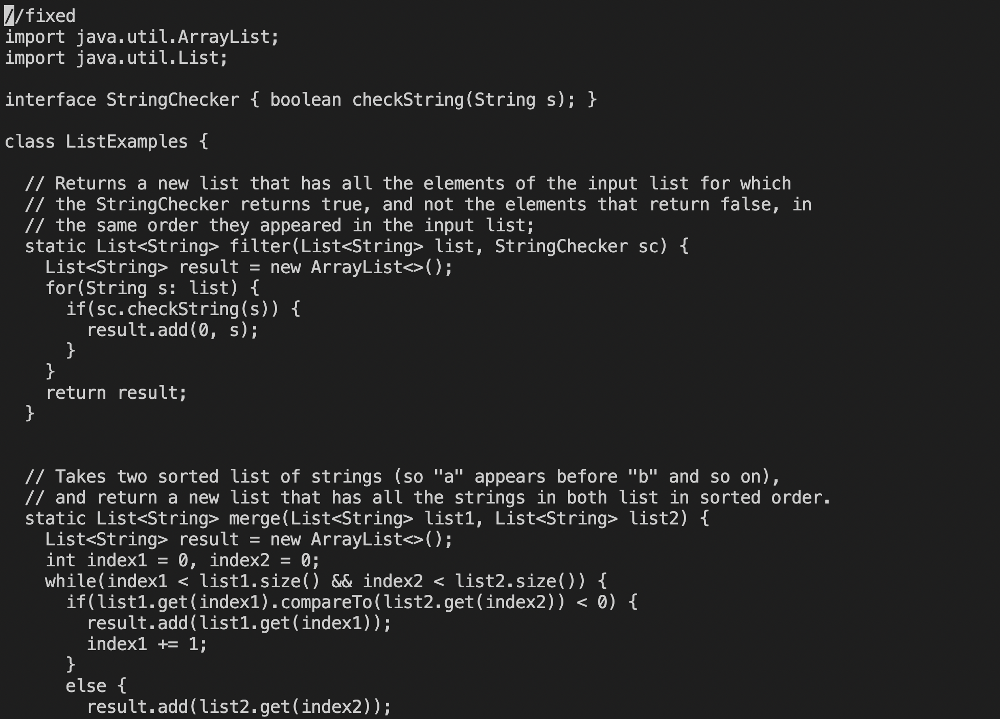
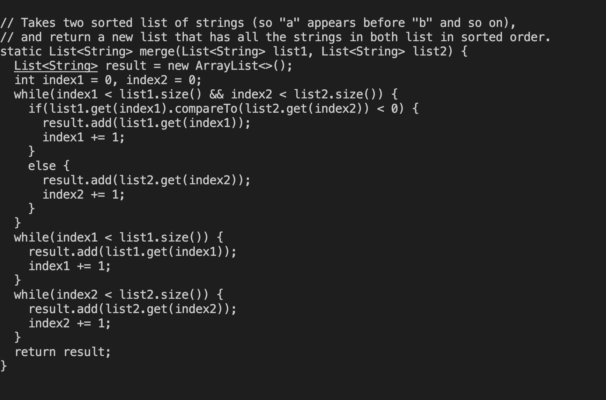
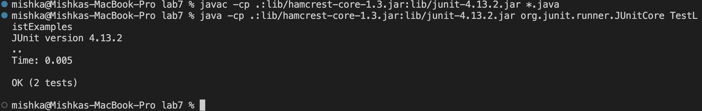
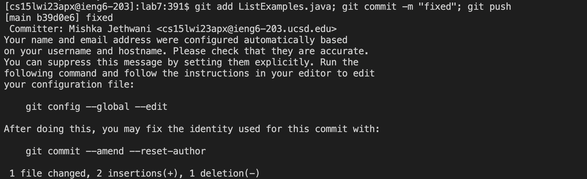

After forking the repository I started the timer, and follwed the following steps to increase my pace and be more efficient  <br>

## Log into ieng6

hi (google.come)

The first step is to login to the your course specific ieng6 account. <br>
Instead of typing in ```ssh cs15lwi23apx@ieng6.ucsd.edu```, I used the ```<Cntrl-R>``` which provided me with the command history where when I typed in "ssh" I got the entire command prompted and just had to press ```<enter>```. 
 So, for logging into my ieng6 account, I used ```<Cntrl-R>```, typed ssh and pressed ```<enter>```.
  


## Clone your fork of the repository from your Github account
 
 After this to clone the repository, Ater copying the link from the github site. 
 I again used ```<Cntrl-R>``` and got access to the command history where on typing _"git c"_, I got the entire command and had to continue by pressing  ```<enter>```.
  
 

## Run the tests, demonstrating that they fail
 
 Again to run the tests I used ```<Cntrl-R>```, typed out javac, which prompted me to ```javac -cp .:lib/hamcrest-core-1.3.jar:lib/junit-4.13.2.jar *.java``` followed by ```<enter>```. The following commands are used to run the JUnit tests from the terminal.
   
 and now, for the second command did the same but typed out just java, which prompted me to ```java -cp .:lib/hamcrest-core-1.3.jar:lib/junit-4.13.2.jar org.junit.runner.JUnitCore```.
   
 This saved much more time since otherwise I would have to go to the course website, look for theese and then copy-paste them.
 After executing theese tests, we can see that they failed.
  
 
 
## Edit the code file to fix the failing test
   
  This showed one test failed, to fix the error I typed in ```nano ListExamples.java```.
  I fixed the error, which was in the last while statement where I had to change index1 to index2, then scrolling all the way up and typing _"fixed"_ as a comment.
  I scrolled all the way down by holding ```<down>``` till I reached the last line of the following command: 
 
```
while(index2 < list2.size()) {
  result.add(list2.get(index2));
  index2 += 1;
}
```
then I pressed ```<right><right><right><right><right><right><right><right><right><right><right><backspace><2>``` to correct the error. After this I held down ```<up>``` to get to the very top of the file and typed in ```//fixed <enter>```.
    



To save and exit I pressed the keys ```<Cntrl-O> <enter> <Cntrl-X>```. ```Cntrl-0``` saves it and ```<Cntrl-X``` is used to exit. 
  
## Run the tests, demonstrating that they now succeed

   To run the tests, I used upper arrow keys: <br>
  For the command ```javac -cp .:lib/hamcrest-core-1.3.jar:lib/junit-4.13.2.jar *.java, I did ``` ```<up><up><enter>```<br>
  and for, ```java -cp .:lib/hamcrest-core-1.3.jar:lib/junit-4.13.2.jar org.junit.runner.JUnitCore``` I did,```<up<up><up><enter>.```<br>
 Which now showed that the tests had passed. 
   
 
## Commit and push the resulting change to your Github account 
 <br>
 
 To go back to the terminal I pressed, ```Cntrl-O <enter> Cntrl-X```. 
 Then to submit and push I put the commands to add, commit and push in the same line to save time. I did this separating the commands by a semicolon. I used the Cntrl-R to type out the first one i.e git add and then typed out the commant for commit and push in the same line seprating them by semicolons.
    
    
git add : The git add command the changes in the working directory. It tells git that you want to include updates to a particular file after committing. However, git add doesn't really affect the repository changes are not actually made to the repository until running git commit.
git commit : The modified files are staged using git add, and following a commit, all files in the staging area are snapshotted and become part of the repository's history.
git push : The git push command is used to upload local repository content to a remote repository. Pushing is how you transfer commits from your local repository to a remote repository.

 
 Doing all of theese steps at first took me 14:23 but after using all these I could do it within 1:16.
 
  
  
  
  
  
  
  


