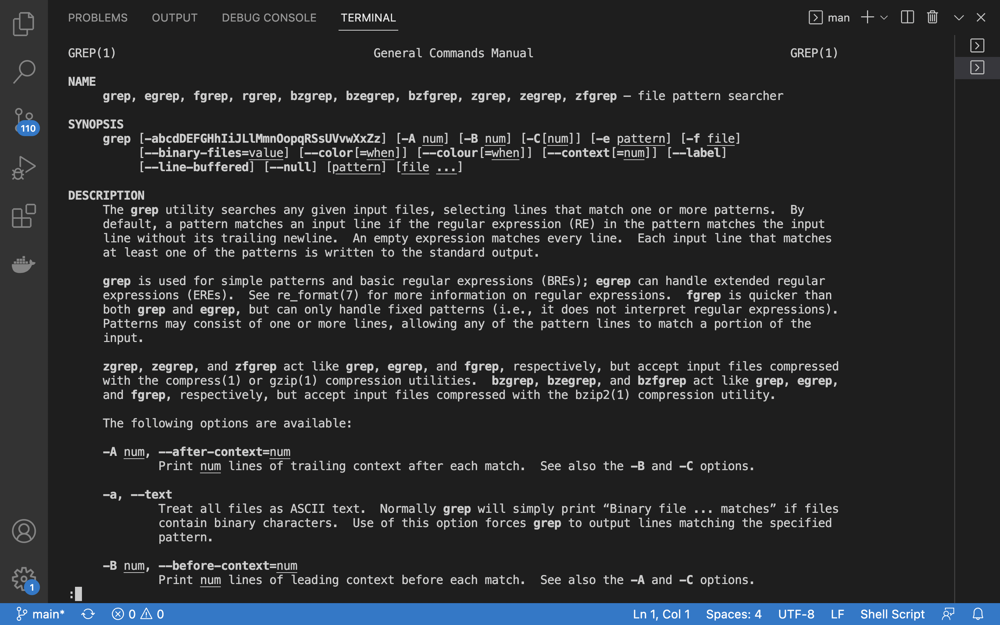
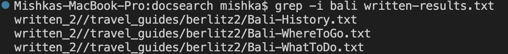
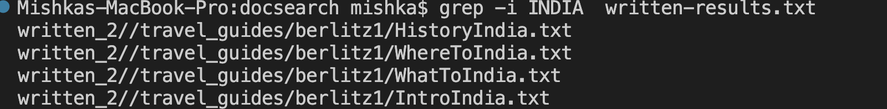
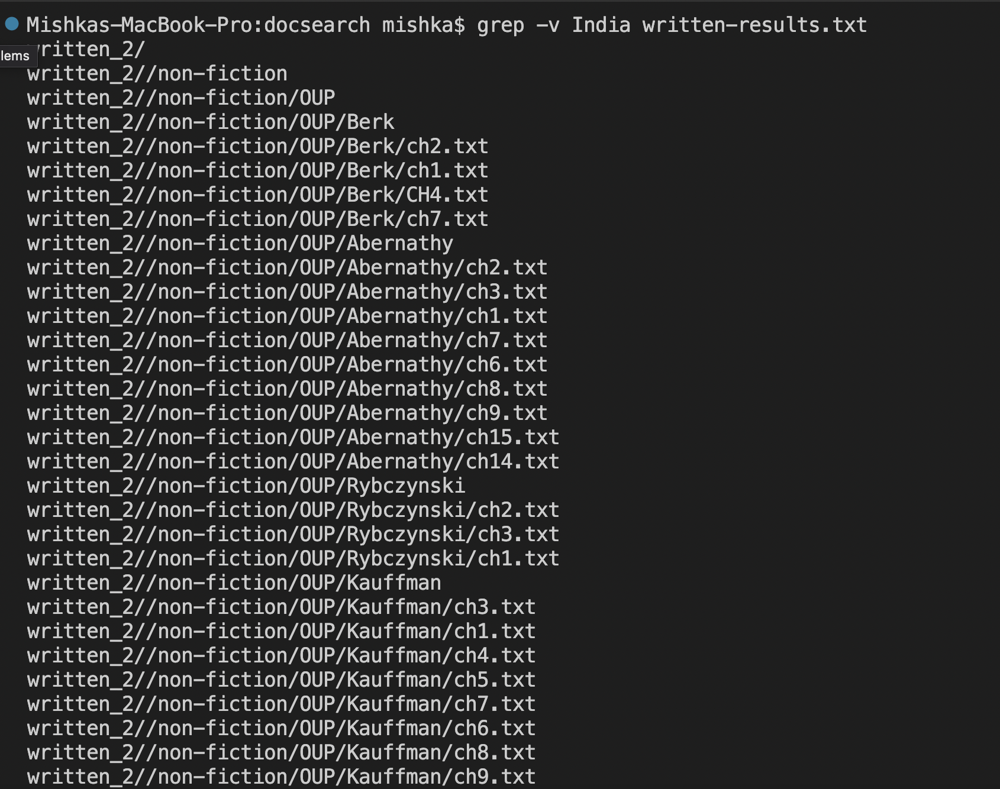
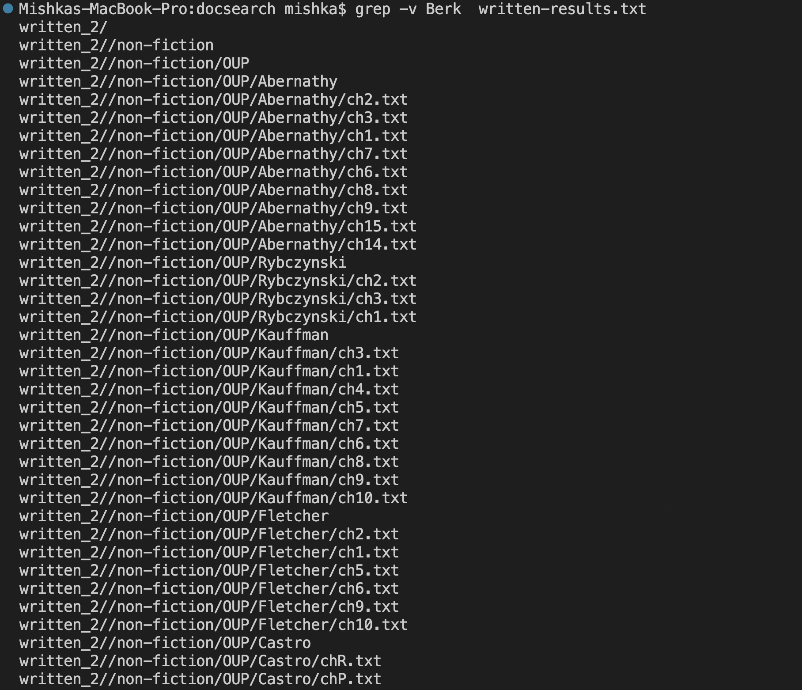

## Lab Report 5

I learned a lot about the find command while doing lab report 3, so I decided to use do the same exploration for the grep command instead this time.

### Researching Commands 

I decided to choose the command grep and find 4 interesting command-line options to use with it. To do so, I asked chat gpt for suggestions. <br>

I decided to use the the following four commands: <br>
1. -i: Perform a case-insensitive search <br> 
2. -v: Invert the match, i.e., select non-matching lines. <br>
3. -n: Precede each matched line with its line number in the file. <br>
4. -l: Only print the names of files that contain a match, not the matching lines themselves. <br>

I also did man grep on the terminal to see the different options.


### -i

I used [this](https://www.ionos.com/digitalguide/server/configuration/linux-grep-command/#:~:text=The%20basic%20syntax%20of%20grep,in%20a%20file%20named%20%E2%80%9Cexample.) to research about this particular command.
-i, ignore-case
It is used to perform case insensitive matching. By default, grep is case sensitive. The -i option is used to perform a case-insensitive search with grep.
For exmaple, In the first command I used ``` grep -i bali written-results.txt  ```, where I typed Bali in all lower case and got the appropriate results regardless.
 <br> 
In the second example I used ```grep -i INDIA  written-results.txt```, where I typed India in all uppercase, but got the appropriate results.
<br> 

## -v
I used the [following site](https://www.warp.dev/terminus/make-grep-case-insensitive#:~:text=To%20recap%2C%20the%20grep%20command,or%20%E2%80%94ignore%2Dcase%20flag.) to research about this particular command.

The -v option in grep stands for "invert match" or "exclude". When used with the grep command, it tells grep to display all the lines that do not match the given pattern.<br> 
Here, In the first example I used ```grep -v India written-results.txt```, through this I could get all the files that did not include India.
 <br> 
In the second example I used ```grep -v Berk  written-results.txt ``` to get all the files that did not include Berk in it.
 <br> 


## -n
To learn more about -n I used [this site](https://www.ionos.com/digitalguide/server/configuration/linux-grep-command/#:~:text=A%20simple%20use%20case%20for,%3A%20grep%20%E2%80%9Ctest%E2%80%9D%20example).
The -n option in the grep command stands for "line number". When used with grep, it displays the line numbers of each matched line in the output.
 <br> 
For example, I used ``` grep -n Berk  written-results.txt```, to find which all line numbers have Berk.
 <br> 
Next I used ```grep -n California  written-results.txt```, to find all the files with the corresponding line number for California. 
 <br> 

## -o
The -o option in grep stands for "only matching" or "show only the matched part of a line".
When used with grep, -o will display only the parts of a line that match the search pattern. This can be useful when you want to extract a specific part of a line that matches a certain pattern or when you want to count the number of occurrences of a specific pattern in a file.
To learn how to use this command I used [this](https://www.ibm.com/docs/da/aix/7.1?topic=files-finding-text-strings-within-grep-command) resource.
First, I did ```grep -o Japan  written-results.txt ```
 <br> 
Then, I used a command ```grep -o Cancun written-results.txt``` 
 <br> 


