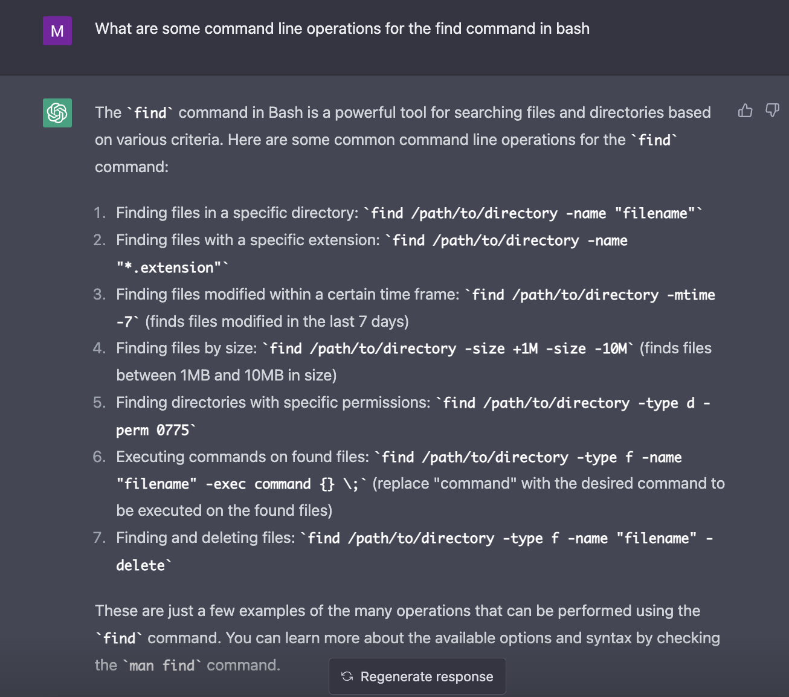
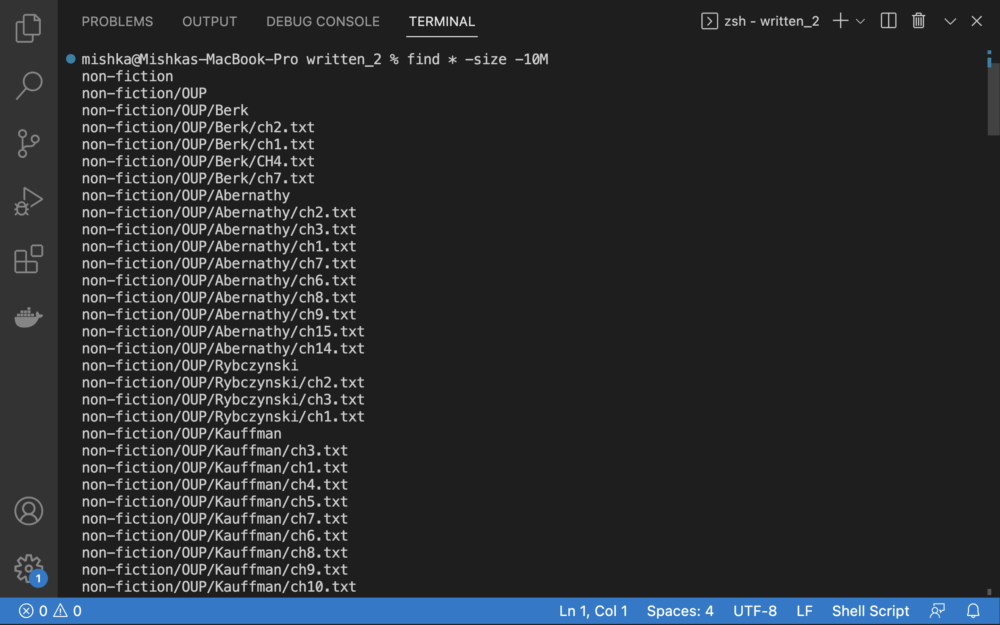
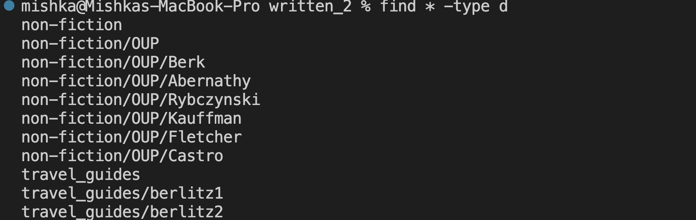
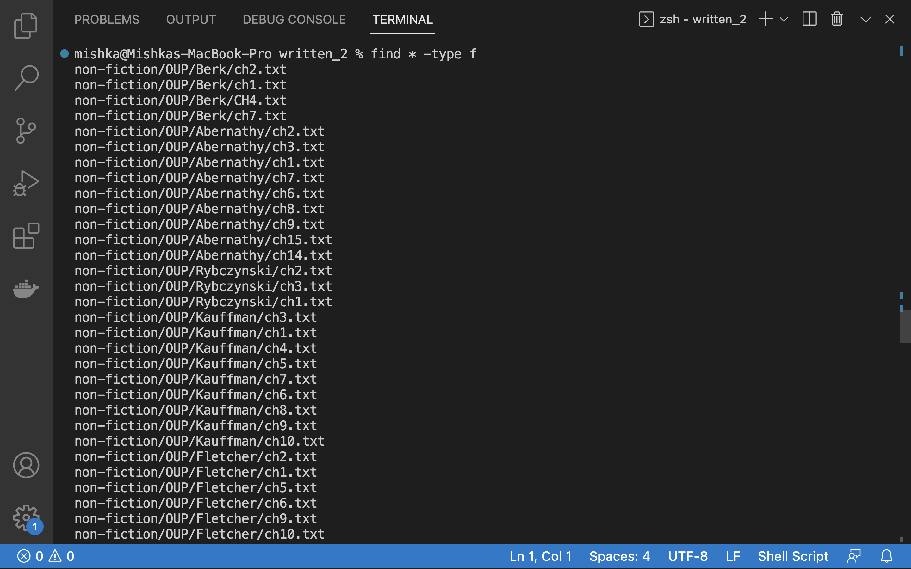
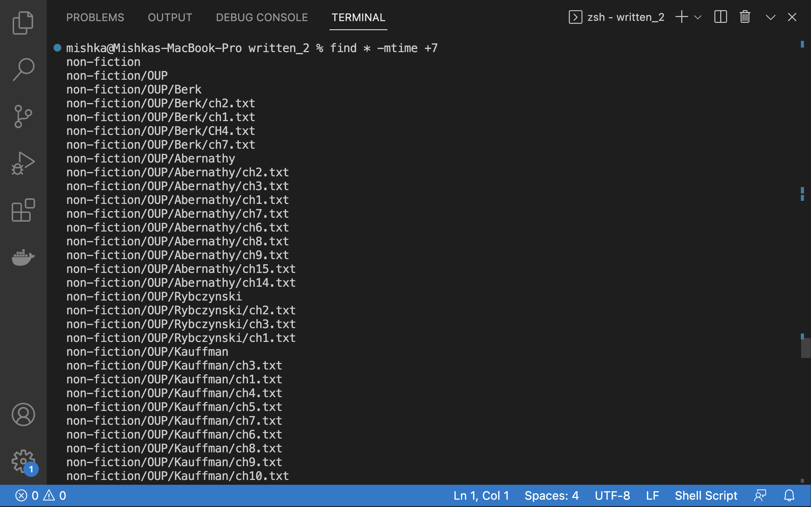
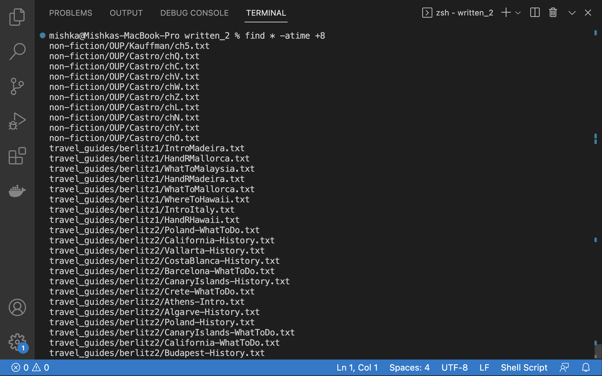
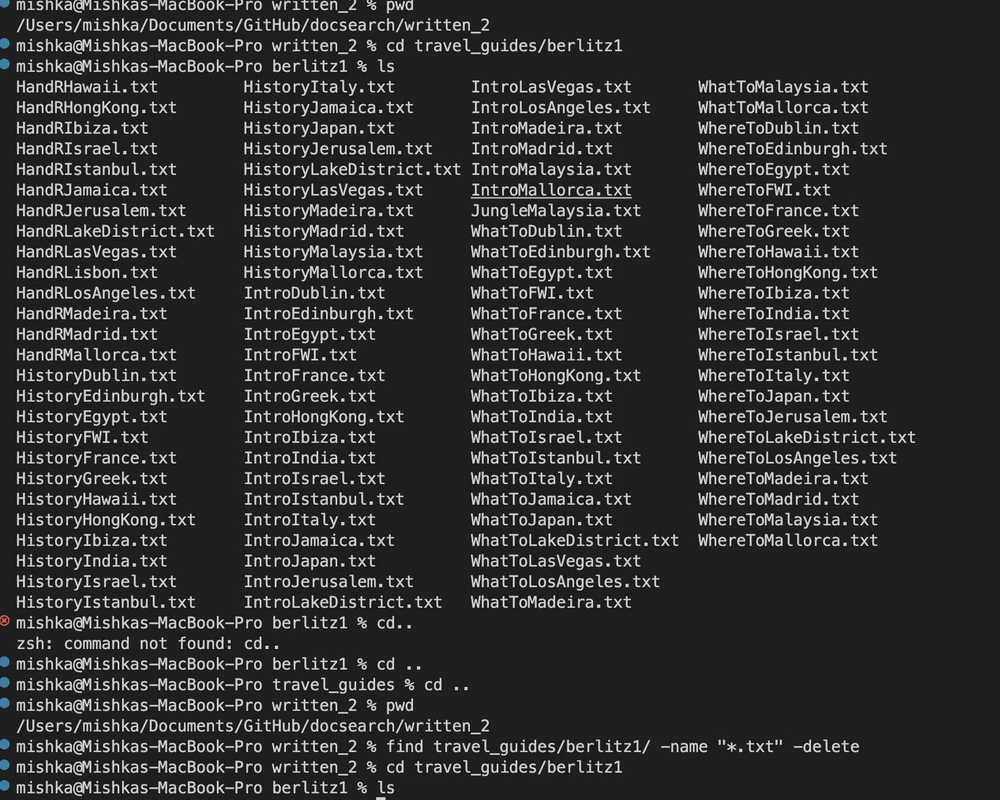
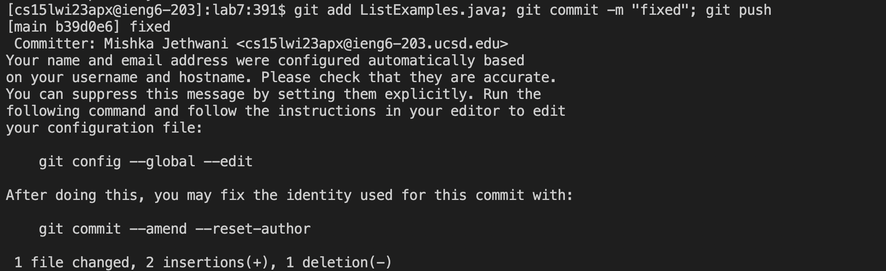

# Researching Commands 

I decided to choose the command find and find 4 interesting command-line options to use with it. To do so, I asked chat gpt for suggestions.  

I decided to use the the following four commands:  
1. "find /path/to/directory -size"   
2. "find /path/to/directory -type"  
3. "find /path/to/directory -mtime"  
4. "find /path/to/directory -name"  

### SIZE 

To get files greater than or smaller than a certain size, this command is used. The command is  "find /path/to/directory -size" followed by a +/- sign and the size of the file. + is used to get files of sizes greater than the specified amount and - is used to get files smaller than the specified amount. 
For exmaple, In the first command I used *find * -size -10M*, which gave me all the files smaller than 10 MB.
   
In the second example I used "find * -size +5M" which gave all the files that were bigger in size than 5MB, which didnt exsist so it displayed nothing.
  

## TYPE

This used to get particular types, such as f is used to get files and d is used to get directories.   
Here, In the first example I used find * -type d to get all the directories.
   
In the second example I used * -type d to get all the files. 
   

## TIME

This is used to find files based on the time they were last modified or accessed usimg -mtime and -atime respectively.   
For example, I used "find * -mtime +7" to get all the files that were modified more than 7 days ago.
   
Next I used "find * -atime +8" to get all the files that were accessed more than 8 days ago. 
   

## NAME

In this I used multiple command-line operators to do specific tasks. 
First, I used "find travel guides/berlitzl/ -name "*.txt" -delete" to delete all the .txt files in the berlitz one folder. This can be seen in the picture below, as I have displayed all the files before and after using the command using ls. 
   
Then, I used a command to cat the file "California-History" to display the contents of that file. 
   

